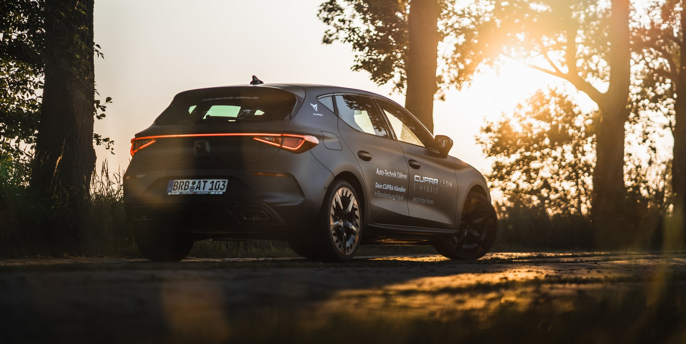
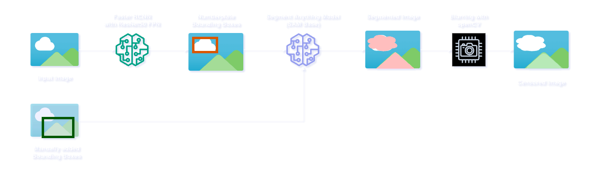

# :oncoming_automobile: Censor Anything :camera:

---

### Automatically censors any numberplate

  
  &#8594;
   

### Add additional objects, faces or text to be censored.

  
  &#8594;
   

### Retains original image quality with high-precision cutouts

  
  &#8594;
   

---

## :bookmark_tabs: Table of Contents
- [:oncoming\_automobile: Censor Anything :camera:](#oncoming_automobile-censor-anything-camera)
    - [Automatically censors any numberplate](#automatically-censors-any-numberplate)
    - [Add additional objects, faces or text to be censored.](#add-additional-objects-faces-or-text-to-be-censored)
    - [Retains original image quality with high-precision cutouts](#retains-original-image-quality-with-high-precision-cutouts)
  - [:bookmark\_tabs: Table of Contents](#bookmark_tabs-table-of-contents)
  - [:information\_source: General Info](#information_source-general-info)
    - [Version 2](#version-2)
  - [:computer: Technologies](#computer-technologies)
  - [:wrench: Installation](#wrench-installation)
  - [:book: Usage](#book-usage)
  - [:page\_facing\_up: License](#page_facing_up-license)

---

## :information_source: General Info
This project was originally inspired by the need to censor license plates on images I took at car meets. The solution was to train a instance segmentation model to detect numberplates and blur numberplates with openCV. 

### Version 2
Seeing a impressive zero-shot demo of Meta AI's [Segment Anything model](https://segment-anything.com/) on Twitter sparked the idea to extend this project to dynamically allow the user to censor any other objects in an image. For more interactivity a object detection model is now only used to predict bounding boxes for numberplates and the user has the ability to draw additional bounding boxes directly on the image. The Segment Anything model then segments these objects with suprising accuracy and the resulting mask is used for censoring the requested parts of the image.

---

## :computer: Technologies

* keras-cv
* Python: 3.10
* OpenCV: 4.5.1
* PyTorch: 2.4.1

###Deployment:
* FastAPI
* node.js with express
* Google Cloud Platform Compute Engine
* Docker 
* GitHub Actions (Docker Build & Deployment)

---

## :wrench: Installation
Describe the installation process. Include any prerequisites, libraries, or APIs that need to be installed.

---

## :book: Usage
Provide instructions on how to use the project after it's installed. Include code examples if applicable.

(Please note that the website is running on a very cheap and thus slow server without GPU acceleration. So inference might take a while :D )

censor-anthing.com

---

## :page_facing_up: License
Include a short description of the license or a link to the full license text.

---

Made by [Max Grundmann](https://github.com/max-gmann)

